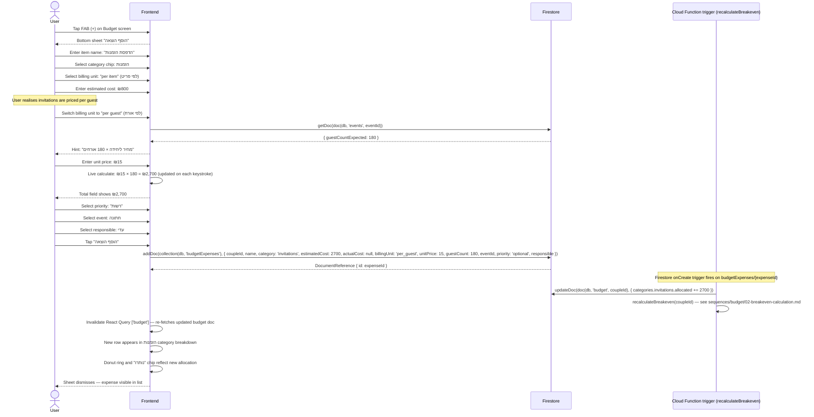

# Add Expense

User taps FAB (+) on the Budget screen to log a new expense item.
Key behaviour: selecting "per guest" billing unit triggers a live total calculation
based on confirmed/expected guest count read directly from Firestore.

The expense is written directly to Firestore. A Firestore-triggered Cloud Function
(`recalculateBreakeven`) fires after each write to update the budget summary.

