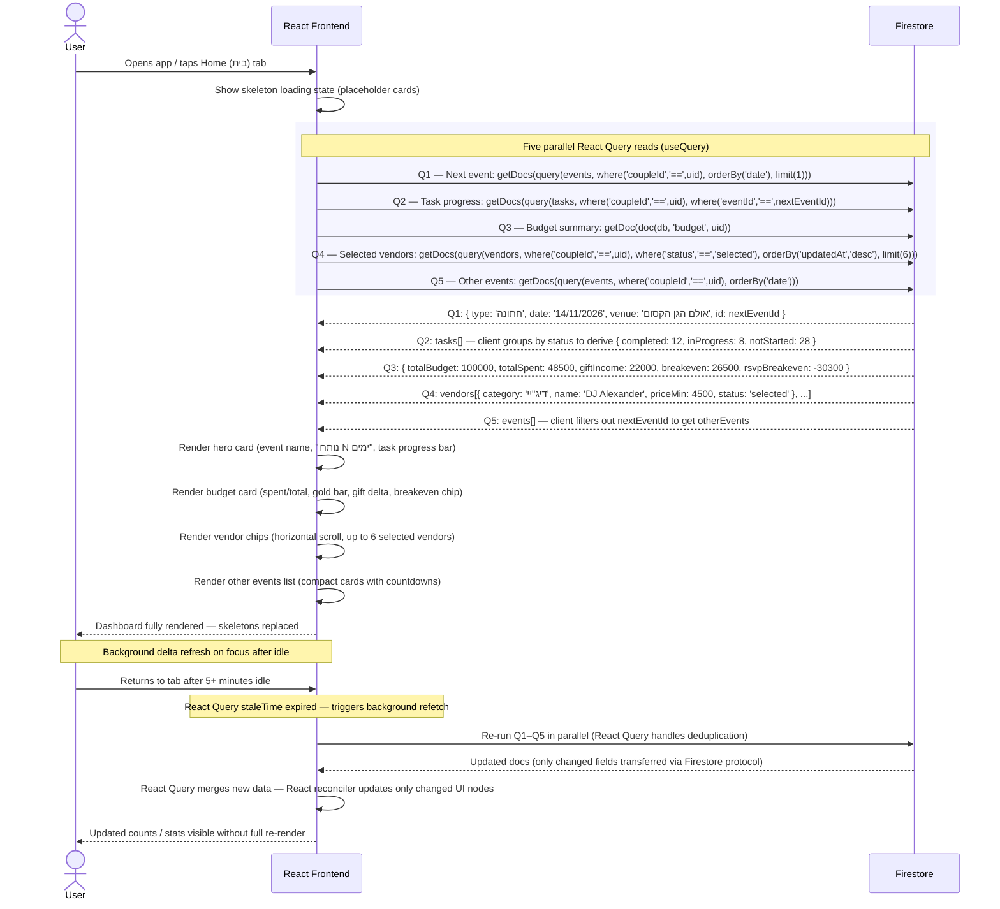

# Load Dashboard

How the dashboard is assembled from multiple data sources when the user opens the
app or taps the Home tab. Five parallel Firestore reads are issued via React Query
and merged into the dashboard payload on the client.

No Cloud Function or server aggregation is needed — the client issues the queries
in parallel and the React Query cache handles deduplication and stale-time.

