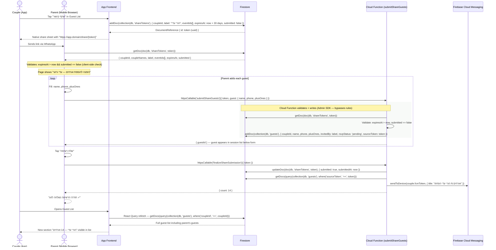

# Parent Share Flow

Couple generates a shareable web link; parent opens it in a plain browser and submits
their guest list without needing the app or a Firebase account.

The parent-facing page (/share/:token) has no Firebase Auth — it calls Cloud Functions
for all data operations. The token UUID acts as a capability: anyone who has the URL
can read the share metadata and submit guests.

