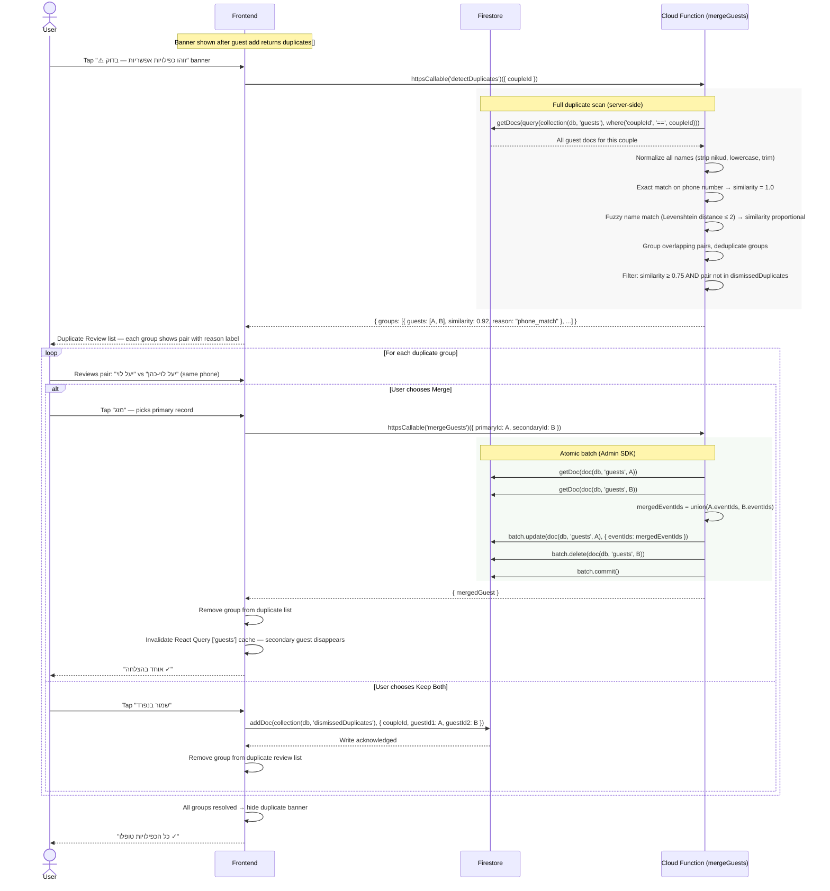

# Duplicate Guest Detection & Resolution

Triggered automatically after each guest add (see sequences/guests/01-add-guest.md).
User can merge duplicates or dismiss them as intentional distinct guests.

Merge is an atomic operation handled by the `mergeGuests` Cloud Function —
it unions the two guests' eventIds and deletes the secondary document in a single batch.

