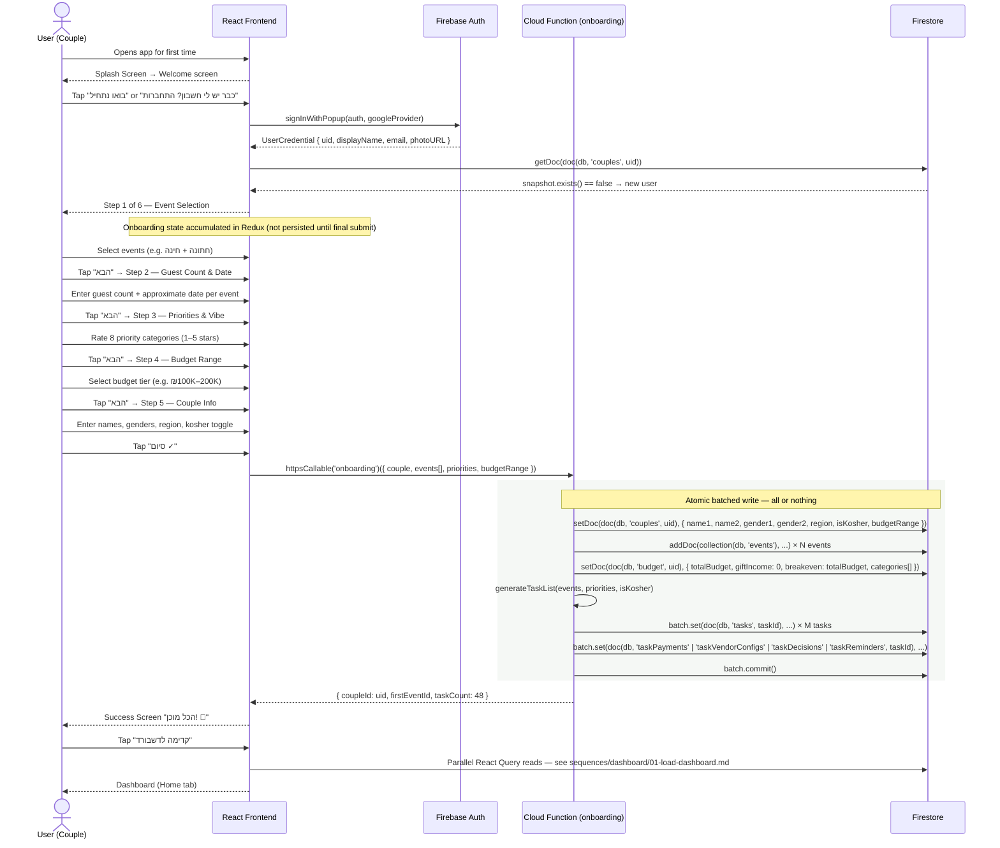

# Signup & Onboarding Flow

Full flow from first app open through completing the 6-step onboarding wizard.

Google Sign-In is the **only** authentication method — there is no email/password form.
Onboarding state accumulates in Redux client state and is persisted in a single atomic
Cloud Function call at the end of step 6.

