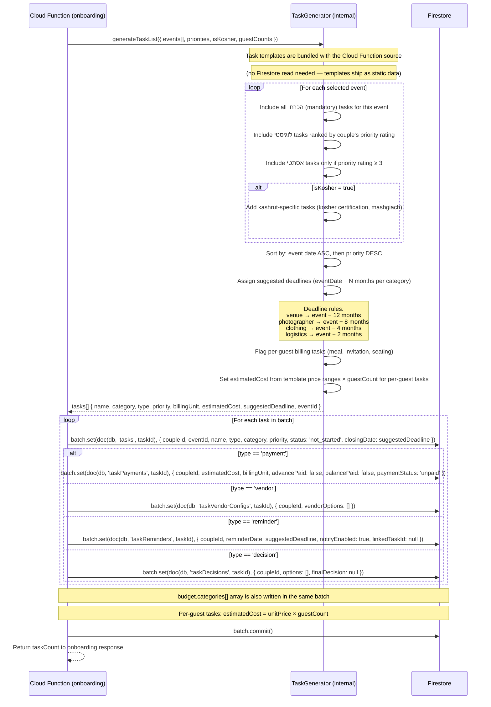

# Task Template Generation

How the `onboarding` Cloud Function auto-generates a personalised task list from
the couple's onboarding answers. Runs inside the atomic batched write of the CF —
see sequences/onboarding/01-signup-and-onboarding.md.

