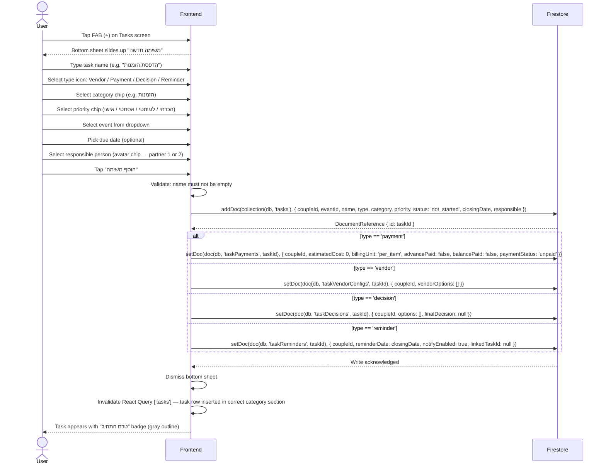

# Create New Task

User taps the FAB (+) on the Tasks screen. A bottom sheet slides up with the full task form.
Task creation is a direct Firestore write. The task type determines which sub-type
detail document is created alongside the base task document.

