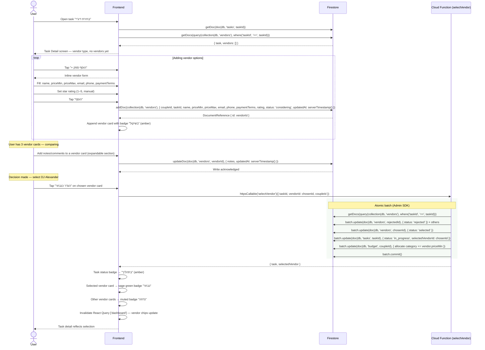

# Vendor Comparison & Selection

User opens a vendor-type task, adds multiple vendor options, compares them, and locks
in one as the selected vendor.

Adding and editing individual vendors is a direct Firestore write.
Selecting a vendor is atomic (updates the chosen vendor to "selected", all others to
"rejected", and the task status to "in_progress") — this goes through the
`selectVendor` Cloud Function.

