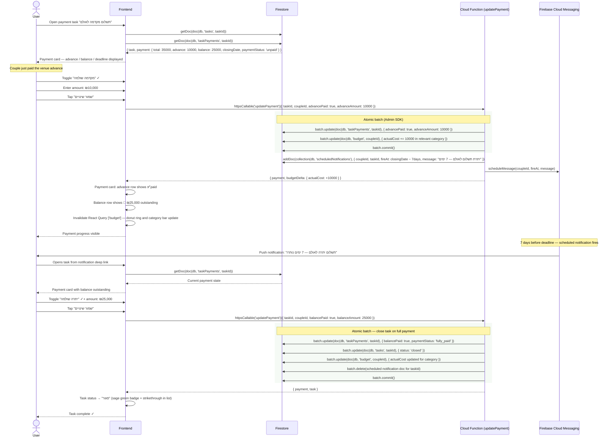

# Payment Tracking Flow

Full lifecycle of a payment-type task: from initial amount entry through marking the
advance paid, receiving a deadline reminder, and finally closing the task when the
balance is settled.

Payment updates go through the `updatePayment` Cloud Function which atomically
syncs the budget's actual cost and schedules/cancels FCM reminder notifications.

